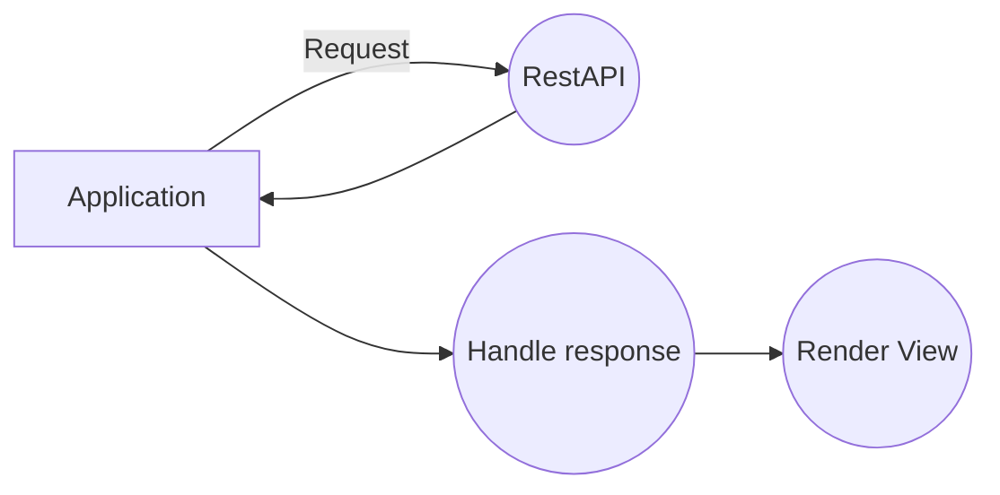

# Flitter ( socialmedia app )
Backend is configure to run on **localhost** as RESTAPI . Server file contains 2 separated server, one with routes that are connected to the DB and returns data, the second one is only for sockets. Socket server is used for locations on the map and for chat. 

Application is no longer supported!

|TYPE                |DESCRIPTION                          |PORT                       | 
|----------------|-------------------------------|-----------------------------|
|RestAPI|`Contains all routes for both apps and returning database data. Some routes are public via GET request and some like login register etc. are protected by with parameters with POST request.  `            |3002            |
|Socket Server|`Socket server is used to connect users on the map and for fast chat application. Doesn't contain any public route!`            |3003            |
|React |`React handle the web application. It's connected to the RestAPI with Socket server. Web applications has less functions than mobile. Sockets are used just for chat application. `|3000|
|React Native |`Mobile application is written in ReactNative. Better to use iOS device but it runs on Android devices just fine. Since development was on iOS, Android could have some problems with permissions. React Native uses Metro and expo cli.   `|19208|

> **RestAPI/SocketServer:**   npm **start** (*/server*)
> **React:**  npm **start** (*/web*)
> **ReactNative:**   expo **start** (*/mobile*)

## How application works

